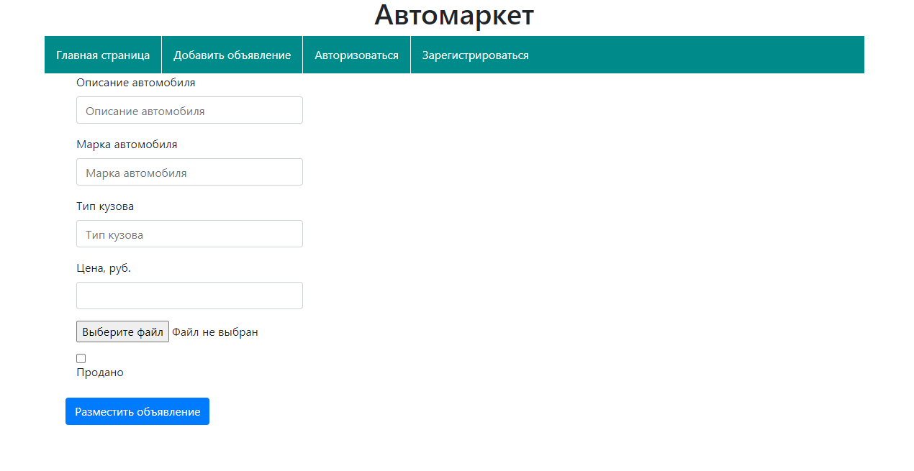
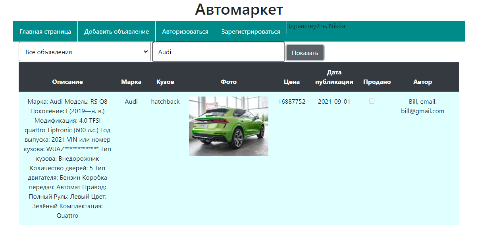
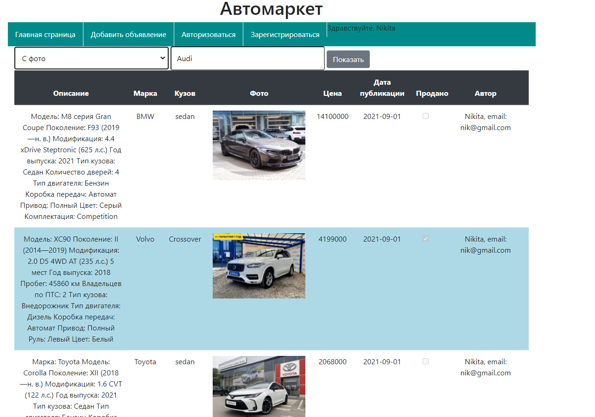
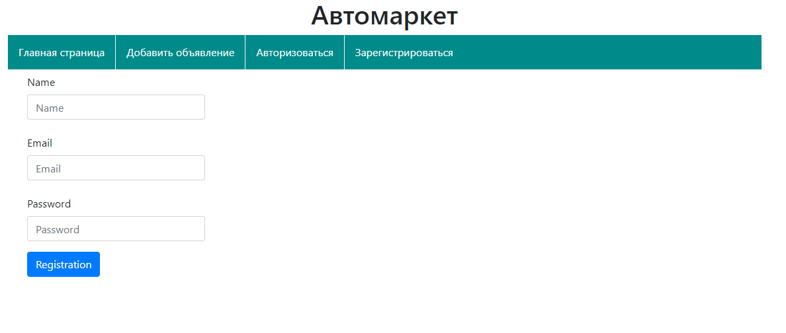
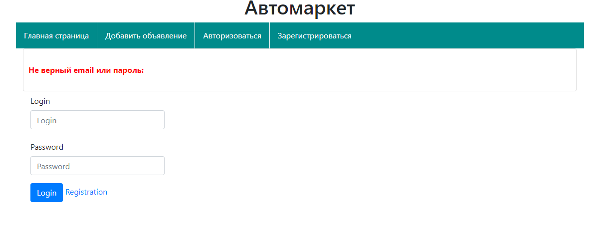

Сервис по продаже автомобилей "Автомаркет".

Основные возможности:
- размещение объявлений о продаже автомобилей с фотографиями;
- возможность обновления информации в объявлениях (доступно только автору объявления);
- предоставление контактной информации продавцов (электронная почта).

Функции:
- просмотр объявлений, в том числе "гостями" сервиса;
- фильтрация объявлений по различным критериям;
- создание и размещение объявлений только авторизованными пользователями;
- возможность прикрепления фотографии автомобиля к объявлению;
- обновление информации объявлений, в том числе изменения статуса объявления.

Стек технологий:
- Java/servlets
- Hibernate (PostgreSQL)
- AJAX/JQuery/JS
- HTML/Bootstrap
- Travis CI

1. На главной странице представлены все объявления

2. Возможность добавления своего объявления

3. Есть возможность поиска объявлений по конкретной марке автомобиля

4. Возможность фильтрации объявлений по дате и содержимому (по наличию фото в объявлении)

5.Добавлять объявления могут, только зарегистрированные пользователи.

6. Доступна возможность редактирования объявления только автором.

